# stereogram-webgl
An autostereogram (also known as Magic Eye) is a 2D image designed to create the illusion of 3D. In each image, there is a 3D object that can only be viewed by looking at the image a certain way, as if the screen was transparent and you looked at the wall behind it. It gets easier with practice.

Autostereograms were very popular in the '90s. They take advantage of stereopsis: the brain tries to reconstruct depth by combining the two slightly different images perceived by each eye.

In this project, you can use your own depth map, customize the tiles as well as the way the image is computed. It all runs on GPU and can also handle live moving scenes in real time.

See it live [here](https://piellardj.github.io/stereogram-webgl/).

See my Magic Eye solver [here](https://piellardj.github.io/stereogram-solver/).

## Preview

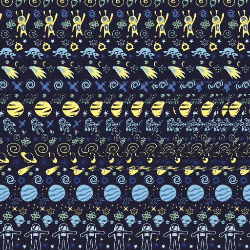

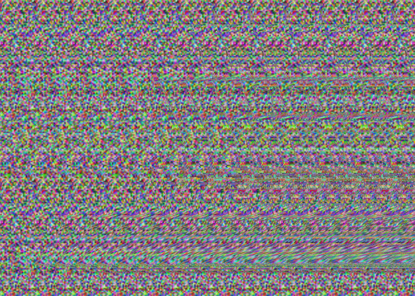

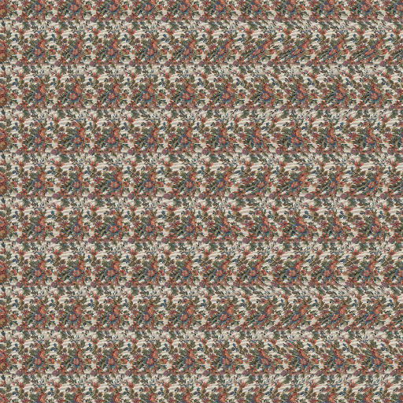

## How to see a stereogram image
### Instructions
Seeing the 3D scene hidden in a stereogram image takes a bit of practice. The key is to look beyond the image, and not focus the image itself. There are several techniques to do it:
- if you are able to, just consciously relax your eyes like if you were looking in the distance
- another technique is to start with your head very close to the screen, so close that you cannot focus it. At this point your eyes should naturally look in the distance. Then move your head back slowly, and don't look at the screen: try to keep your eyes looking in the vague
- another one is to use an object like a pen: place it behind your screen, on the side so you can see it. Keep staring at it, and move it slowly towards the center of the screen. This should help you look beyond the screen.

If you cannot quite see a clear 3D object but you still feel something weird, you are certainly on good track.

### Exercises
Below are images you can practice on while training. For each of them, you need to have the correct way of looking at them.

    

        <i>Try to relax your eyes, and you should see a third black dot appear in the middle.</i>
    

    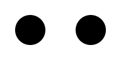

    

        <i>Practice your look on this image, and you should see each row float at a different depth: the daisies look far away, the red flowers are a bit closer, then the blue butterfly, and finally the yellow flowers are the closest.</i>
    

    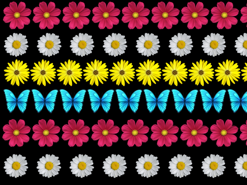

    

        <i>This is the last practice image. If you look at it correctly, you should clearly see a 3D object.</i>
    

    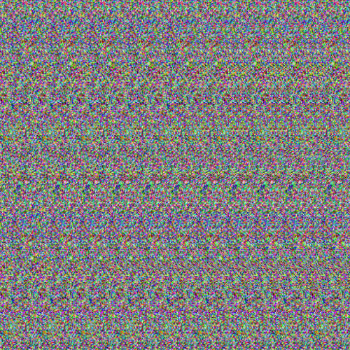

## How does it work
### Base idea

The brain perceives depth by combining the two slightly different images coming from our eyes. If an object looks exactly the same from both eyes, it means the object is far in the distance. On the contrary, if an object looks very different from each eye, it means the eyes each have a different perspective on it, so the object must be very close.

Since depth perception is based on binocular vision, if we want the show a 3D object in our 2D image, we must trick the brain into thinking each eye sees a different perspective of our 3D object. If you look directly at the image, it does not work: the brain clearly sees the image is 2D. So the viewer has to focus a point either before the image, or behind it.

Now, we must understand how to build the image. Let's see what happens if someones looks at an object through a transparent screen:

    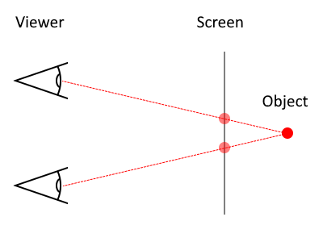
    

        <i>As you can see, there are two "ghosts" of the object on the screen, because of the eyes having different positions relatively to the object.</i>
    

Now let's compare two situations: one object is near and the other is far away:

    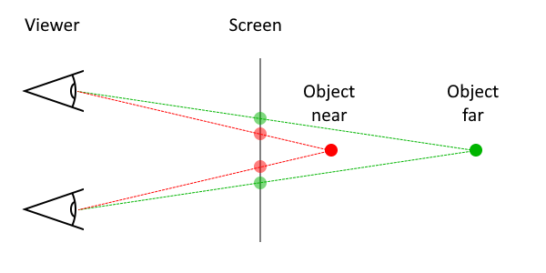
    

        <i>The closer an object is to the screen, the closer its ghosts are on the screen.</i>
    

In conclusion, provided the viewer does not look directly at the image but beyond it, if we repeat some pattern on the image, the brain will interpret it as the pattern actually being behind the screen. Moreover, by changing the frequency of the repetitions, we can create an impression of relative depth: a pattern with close repetitions will appear closer than a pattern with distanced repetitions. This explains why on the image below, the daisies appear further away than the butterflies.

    
    

        <i>When looking beyond this image, the daisies appear further away than the butterflies because of the difference in repetition frequency.</i>
    

Another interesting property is that only one repetition is needed to perceive depth. This means that on a same row, we can vary the perceived depth by changing the frequency of the repetitions, creating a slope effect.

    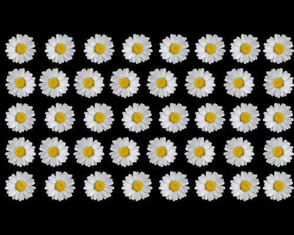
    

        <i>On each row, the repetition frequency varies. This gives the perception of depth variation on each row.</i>
    

### Algorithm
We want to generate an autostereogram given the following inputs:
- a depth map encoded as a black and white image, in this example a sphere;
- a base pattern, in this example a seamless clouds texture.

Since this is all about repetition, let's define our base repetition period in pixels. Then let's split our target image into vertical stripes, each having the repetition period as width.

    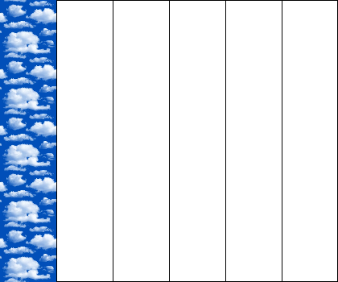
    

        <i>Target image split into 5 vertical stripes, plus the reference stripe on the left.</i>
    

Since this is all about repetition, let's make each stripe a repetition of the previous one. The far-left stripe serves as reference:

    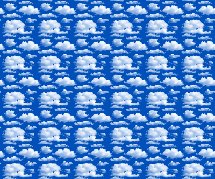
    

        <i>By repeating the first stripe without displacement, the viewer only perceives a flat surface.</i>
    

Now we want to make it 3D, so let's introduce horizontal displacement: each stripe will be a displaced version of the previous one. Each pixel has a distinct local displacement, given by sampling the depth map at that position. Since the far-left stripe is the first one, it does not have a reference so it will not be deformed. However I do not want to truncate the depth map, so just scale it down and shift it to the right so that all of it is sampled.

    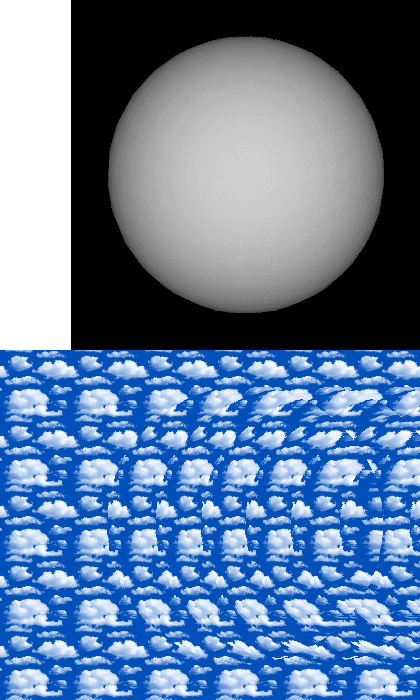
    

        <i>By repeating the first stripe and adding with displacement, the viewer perceives the 3D objects.</i>
    

In the end, every pixel on the image is a displaced version of the source stripe. Here is an illustration to better see the displacement:

    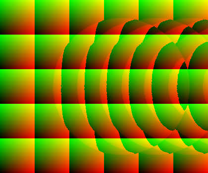
    

        <i>By displaying the UV coordinates the tile will be sampled at, the displacement is more visible. One can clearly see the sphere-shaped displacement sampled from the depth map.</i>
    

